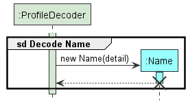
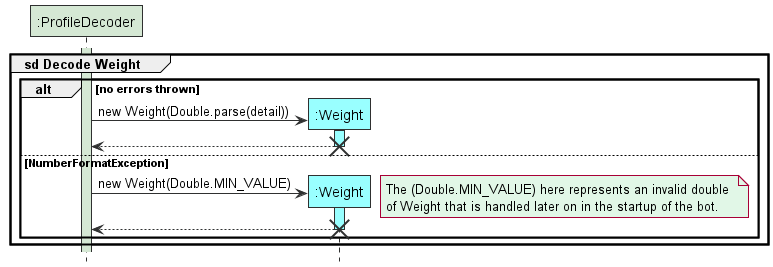
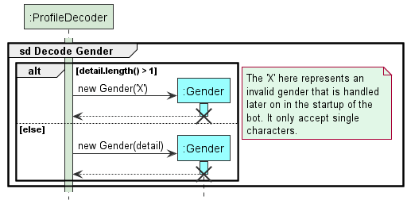
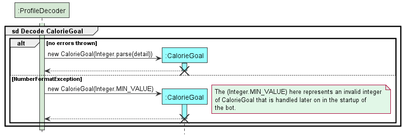
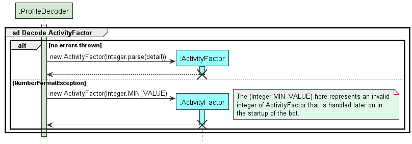
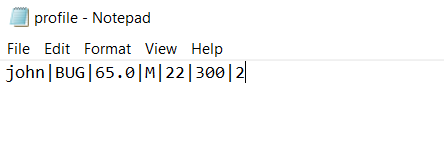

The aim of this guide is to help the reader to understand how the system and components of Fitbot is
designed, implemented and tested. In the same time, this developer guide also serves to help developers who are interested in understanding the architecture
of Fitbot and some design considerations.
[Don't know about Fitbot? Click here to find more.](#https://ay2122s1-cs2113t-f14-2.github.io/tp/UserGuide.html)

## Content page
[Acknowledgements](#acknowledgements)

[Design](#design)
- [Architecture](#architecture)
- [Data Component (Profile)](#data-component-profile)
- [Data Component (ItemBank and Item)](#data-component-itembank-and-item)
  - [ItemBank](#itembank-class)
  - [Item](#item-class)
- [Logic Component](#logic-component)
- [Storage Component](#storage-component)
- [Implementation](#implementation)
   - [Add Food Item Feature](#proposed-add-a-food-item-feature)
   - [Design Considerations](#design-considerations)
   - [Loading Of Data On Startup](#loading-of-data-on-startup)
   - [Create Profile If Not Exist On Startup](#create-profile-if-not-exist-on-startup)
- [Product Scope](#product-scope)
   - [Target User Profile](#target-user-profile)
   - [Value Proposition](#value-proposition)
- [User Stories](#user-stories)
- [Non-functional Requirements](#non-functional-requirements)
- [Glossary](#glossary)
- [Instruction for Manual Testing](#instructions-for-manual-testing)
  - [Launch](#launch)
  - [Setting Up Profile](#setting-up-profile)
  - [Customising Profile](#customising-profile)
  - [Recording Food Items](#recording-food-items)
  - [Recording Exercise Items](#recording-exercise-items)
  - [Scheduling Exercises](#scheduling-exercises)
  - [Building Food Bank](#building-food-bank)
  - [Building Exercise Bank](#building-exercise-bank)
  - [Exiting Program](#exiting-program)
  - [Manipulating Data](#manipulating-data)
  - [Saving Data](#saving-data)

## Acknowledgements

{list here sources of all reused/adapted ideas, code, documentation, and third-party libraries -- include links to the original source as well}

## Design 

### Architecture

  <image width="70%" src="images/ArchitectureDiagram.png" alt="Architecture Diagram"/>

`Main` class is the component that interacts with all the necessary classes.
The `Main` class consists of the few components as shown below:
- `Ui`: The interaction between user and application
- `Logic`: Parse commands and execute them respectively
- `Data`: allow users to perform CRUD operations on the data in the application
- `Storage`: stores all data in the application. Saves a copy of data in relevant files.
  Data will be retrieved from storage upon starting of application.

Upon launching of application:
- The application will check if there are files that are already stored in the respective folder.
  If there is such files, the contents of the files will be loaded to the data section of the application.
  Instances of profile, data(e.g. FoodList, ExerciseList, FutureExerciseList, ItemBank) and storage will be created

Upon exiting of application:
- The application will save all data into the files created. All instance of components will be cleared automatically.

Class diagram of Main

  

When _Fitbot_ is being started, the above instances are being created in the main class. 
All the classes are marked as 1 as the main class require these instance to perform successful operations.
ItemBank contains 2 instances as 1 is required for foodBank while the other is for exerciseBank.

- Main class start of by running the `start()` function which loads all information using StorageManager class to the 
Profile, FoodList, ExerciseList,ItemBank(foodBank, exerciseBank).
-Next main class will check if user contains the profile using the `checkAndCreateProfile()`. If user does not have
a profile, the application will assist user to create a profile by prompting questions.
- `loadsFutureExercisesToList()` loads future exercises to FutureExerciseList.
- After loading and creating profile, the main program will enter `enterTaskModeUntlByeCommand()` for user
to interact with the application
- Once user has keyed in the command `bye`, the main program will exit out of the `enterTaskModeUntlByeCommand()`
and run the `exit()` command to exit the application.

Interaction between the classes could be shown by the uml sequence diagram below.

  

-When there is an input, the Ui class will retrieve the information from the user.
-Once the Main class receives the input, it creates a new Parser class to parse the commands.
-Depends on the method, in this case add food command, main class will execute the command class(not shown)
based on the command the parser detects.
- The command class will add the food item into the `Data` and updates the `storage` instance accordingly.
- when all the operations above are completed, the Main class will pass a message to Ui class.
- Ui class wll then format the message and print it to console for the user.

### Data Component (Profile)

  

A `Profile` class has various attributes such as `Name`, `Height`, `Weight`, `Gender`, `Age`, `CalorieGoal` and `ActivityFactor`

- Using these attributes it is able to calculate an estimated Basal Metabolic Rate (BMR) using the Harris-Benedict Equation based on your activity levels. Therefore, while calculating your net calories for the day, your BMR is factored in to give you an estimated calculation of your net calorie.

- All the attributes implement a `Verifiable` interface to enable us to check if the attributes are valid. This is important for the setting up of profile or the loading of profile from storage to ensure data integrity of the user's attributes.

### Data Component (ItemBank and Item)

  

The `Data` component is responsible to perform operations such as data modification and query in the code. It receives the commands from the `Logic` component, execute the 
correct operations, and finally return the command result back to `Logic` component.\
\
Above is a high-level **_class diagram_** for the `ItemBank` and `Item` classes in `Data` component. Note that since `Main` and `Logic` components have accessed to some classes
in `Data` component, they form **_dependencies_** with those classes.
The main purpose of having `ItemBank` and `Item` classes is to allow user to perform writing, reading, editing and deleting operations in the program.

#### ItemBank class
`ItemBank` is the ***highest superclass*** that contains one attribute called `internalItems` which is an _array list_ of `Item`.\
`ItemList` being the ***subclass*** of `ItemBank` and ***superclass*** of `FoodList` and `ExerciseList`, which inherits all the methods available from `ItemBank`, with additional methods that form a dependency on `Item` class.\
`FoodList` and `ExerciseList` are ***subclass***  that inherit all the methods available from `ItemList`, while each of them also contains more methods that form a dependency
on `Food` class and `Exercise` class respectively.\
`FutureExerciseList` is a ***subclass***  that inherit all the methods available from `ExerciseList` and contains other methods that form a dependency
on `Exercise` class.

#### Item class
An `Item` class contains two attributes, `name` which represents the name of the item, and `calories` which represents the calorie intake/burnt from the item.\
`Food` and `Exercise` are the only two **_subclasses_** inherit the `Item` class. \
`Food` class has two extra attributes called `dateTime` and `timePeriod`, the former stores the consumed food date and time, while the latter compute the time period 
(only value such as **`Morning`, `Afternoon`, `Evening`** and **`Night`** as shown in the enumeration class `TimePeriod`) of the food consumed time. Note that the `timePeriod` 
value must present when a `Food` object is created.\
`Exercise` class has one extra attribute called `date` which stores the date of the exercise taken.\
\
Abstract classes of Items and ItemLists acts as an agent for meaningful subclasses of Food and Exercise to inherit its attributes and functionality for a more concise use-case.

### Ui Component

The `Ui` component interacts with the user. It reads in input from the user and prints messages on the console.
Below shows a class diagram of how `Ui` component interacts with the rest of the application.

  

Ui Class also consists of `Statistics` Class, which is instantiated by `OverviewCommand` Class and returns messages to
back to the `OverviewCommand` Class, before passing message to `Ui` for formatting.

### Logic Component
 
The `Logic` component is responsible for making sense of user input.

Below is a high level class diagram of the `Logic` component, which shows how it interacts with other components 
like `Main` and `Data`.

   

The general workflow of the `Logic` component is as follows:
1. After `Main`  receives user input, it feeds this user input to the `ParserManager`.
2. The `ParserManager` parses the user input and creates an `Command` object.
   - More specifically, it creates a `XYZCommand` object, where `XYZ` is a placeholder for the 
      specific command type, e.g `AddFoodCommand`, `UpdateProfileCommand`, etc.
   - `XYZCommand` class inherits from the abstract class `Command`, which is used to represent all executable commands in the application.
3. `ParserManager` returns the `Command` object to `Main`, which then executes the `Command`.
4. After execution, all `Command` objects stores the result of the execution in a `CommandResult` object. 
This `CommandResult` object is then returned to `Main`.

Here is a more detailed class diagram of the `Logic` component.

  

Taking a closer look into the parsing process, the `ParserManager` actually does not do most of the parsing itself.
Instead, `ParserManager` creates `XYZCommandParser`,  which is then responsible 
for creating the specific `XYZCommand`. All `XYZCommandParser` classes implement the interface `Parser`, which dictates that 
they are able to parse user inputs. They also make use of utility methods stored in `ParserUtils` to extract 
all the parameters relevant to the command. After parsing the input, `XYZCommandParser` returns `XYZCommand` to `ParserManager`,
which then returns the same `XYZCommand` to `Main`.

### Storage component

This is a (partial) class diagram that represents the `Storage` component.

  

1. Firstly, `Storage` inherits each of the `XYZStorage` interfaces. This ensures the `Storage` API has the relevant load and save functions
of the various storages. 
2. `StorageManager` then implements the `Storage` API that contains the relevant functionalities and instantiates `XYZStorage` using the respective `XYZStorageUtils`.
3. Each of the `XYZStorageUtils` utilizes the general classes of `FileChecker` to create/check for their files and `FileSaver` to write to their respective files.
4. `XYZStorageUtils` also uses `XYZDecoder` to decode files from the saved .txt file and a `XYZEncoder` to encode items into the saved file.

The `StorageManager` component loads and saves:

- your profile: name, height, weight, gender, age, calorie goal and activity factor
- list of exercises done: including date performed
- list of food consumed: including date and time of consumption
- upcoming exercises: recurring exercises that are scheduled in the future
- food and exercise banks: names and calories of relevant item

This way of design ensures that each class has the correct methods to perform its capabilities.

### Main Component

#### Create Profile (StartState)

  

- When the `StartState` method is being called, it instantiated and execute methods in the 7 classes, which are 
`NameCreator`, `HeightCreator`, `WeightCreator`, `GenderCreator`, `AgeCreator`, `CalorieGoalCreator` and 
`ActivityFactorCreator`.
- The above Classes instantiated by `StartState` are inherited from `AttributeCreator` class.

## Implementation

This section describes some noteworthy details on how certain features are implemented
and some design considerations.

#### Parsing of Commands
The sequence diagram below models the interactions between the different classes within the Logic component.
This particular case illustrates how a user input add f/potato c/20 is parsed and process to execute the appropriate actions.

  

#### [Proposed] Add a Food Item Feature

The purpose of this feature is to allow the user to add food item to the food list. The above diagram shown is the 
sequence diagram of the process of adding the food item. 

When the user gives an input, the `parser` from the `Logic` component will try to read the input, and then call the correct
command. In this case we assume that the correct format of **Add Food** input is given and the `AddFoodCommand` has already been
called and created.

Step 1: When the `execute` method in the `AddFoodCommand` is being called, it will first check that if the `isCalorieFromBank`
condition is `true`, meaning that the description of the input food item can be found in the `FoodBank` object, 
as shown in the `alt` frames of the sequence diagram. In each alternative paths, a new `Food` class object will be created
by using the `Food` constructor.

Step 2: When the `Food` constructor is called, it will perform a [self-invocation](#_self-invocation_)`setTimePeriod` to set the enum value `timePeriod`
of the Food. After that, it returns the Food object to the `AddFoodCommand`.

Step 3: The `AddFoodCommand` then calls the method `addItem` from the `FoodList` object, which performs the add food operation in the
`Food List`. After the new `Food` Item is added, it will perform a [self-invocation](#_self-invocation_) `sortList` to sort the `FoodList`. Since the 
`addItem` method is void type, nothing is returned to `AddFoodCommand`.

Step 4: After the `addItem` method is executed without giving any error, the `AddFoodCommand` then calls a `CommandResult` object.
This object will return and output the message indicates that the `AddFoodCommand` is executed without any error. At this
stage, the `AddFoodCommand` is successfully ended.

After all the steps are done, the `command`, `food` and `commandResult` objects are no longer referenced and hence get removed
by the `Garbage Collector` in Java. However ,the lifeline of `foodBank` and `foodList` objects are still continuing because they
are created in `Main` class and have the potential to get referenced by other commands call such as `delete`, `view` and `edit`.

One may also observe that the lifeline does not end even though the object is deleted and no longer be referenced. This problem
is due to the flaw of the drawing tool, *PlantUml* used. For a more accurate sequence diagram, the lifeline should end immediately
once the object is no longer referenced.

#### Design considerations:

The current data structure used in `FoodList` is [Array List](#_array-list_). The rationale of choosing an array list implementation is because
it supports resizability and random accessibility. However, the drawback of such an array list is that sorting requires 
O(n2), which slows down the code efficiency. In the future increment, alternative data structures such as
[Priority Queue](#_priority-queue_) and [Min Heap](#_min-heap_) can be implemented to achieve O(logn) addition and they are
naturally sorted and thus no additional sorting required.

The same reasoning for the class `ItemBank`, which is the superclass of `FoodList` and `ExerciseList`,the current implementation
data structure is also an [Array List](#_array-list_). In the future increment, since the `ItemBank` need to perform query 
operation frequently and the items inside need to be sorted alphabetically, the data structure of the attribute will be changed 
to [TreeMap](#_tree-map_) to achieve O(logn) query time.

  

#### [Proposed] Add a Recurring Exercise Feature

The purpose of this feature is to allow the user to add recurring exercises to the future exercise list. The above diagram 
is the sequence diagram of adding recurring exercises to the future exercise list.

Step 1: The `parser` from the `Logic` component parses the input given by the user and calls the `execute` method in
`AddRecurringExerciseCommand`. The condition `isCalorieFromBank` is checked to see if the user input any calories for
the recurring exercise. If it is `true`, it means that no calories input is detected and the method 
`getCaloriesOfItemWithMatchingName` in class `ItemBank` is called, and it will return an int value of `calories`.

Step 2: Within `execute` method, `addRecurringItem` method in `FutureExerciseList` is also called. This method will 
iteratively call the constructor for `Exercise` class and add the exercises into `FutureExerciseList` via the self-invocation
`addItem` method. This iteration will end when all exercises on `dayOfTheWeek` between `startDate` and `endDate` are added.

Step 3: After `addRecurringExercises` method is executed, `AddRecurringExerciseCommand` calls a `CommandResult` object.
This object outputs a message and `AddRecurringExerciseCommand` will return `commandResult`, indicating that
`AddRecurringExerciseCommand` is successfully executed and ended.

#### Loading of Data On StartUp

There are many files that are used for our current implementation. 
Therefore, since they are similar in behaviour and function, we will only be looking at the loading of the Profile component on the starting up of _Fitbot_.

  

Upon successful launch of the application, `Main` will call to initialize `StorageManager`. 
This in turn initializes all the subclasses of `Storage`, including `ProfileStorage`, with their respective file paths. 
Afterwhich, `Main` calls a loading function `loadAll` that in turns calls the `loadProfile()` method of `ProfileStorage`.

`ProfileStorage` then does 2 main things: 

1. Checks and creates the file if it is missing.
2. Retrieves the data from the file with the use of the ProfileDecoder to decode.

Reference Diagram: Checks for the file and create directory if it does not exist

  

The diagram above explains how the application checks if a file exists. If it exists, it will not perform any additional functionality. Otherwise, it will generate a new file in preparation for storage.

Reference Diagram: Retrieval of data from storage with the use of ProfileDecoder to decode

  

The diagram above explains the processes to decode the items from the file.

Upon reaching the `decodeProfile(line)` method, the reference frame depicts a process of decoding its attributes one by one to ensure that they are able to detect each attribute's readability from storage.
If the methods are unable to read the respective attribute from storage, an invalid attribute will be initialized. This then returns an initialized profile with invalid attributes for `StartState` to catch, allowing users to change
their attributes instead of losing their entire profile data on startup. 

Reference Diagram: Decode all attributes\

Below represents each of the attribute's decoding process:

Reference Diagram: Decode Name\

Reference Diagram: Decode Height\

Reference Diagram: Decode Weight\

Reference Diagram: Decode Gender\

Reference Diagram: Decode Age\

Reference Diagram: Decode CalorieGoal\

Reference Diagram: Decode Name\

The other storages load in a similar fashion to this, except for each decoder, they decode `Item` for `ItemBank`s, `Food` for `FoodList` and `Exercise` for `ExerciseList`.

#### Create Profile If Not Exist On Startup

When user first enters _Fitbot_, the profile of the user is not set up (attributes may not exist). If user were to 
interact with the application, there might be incorrect output, 
therefore the `checkAndCreateProfile()` is implemented to check whether the profile exist
and if it does not exist, _Fitbot_ will guide user through to fill up the profile attributes.

  

On startup, the main function will run `checkAndCreateProfile()` (not in diagram), which will cause StartState
instance to be created by dataManager and run  `new StartState.checkAndCreateProfile()`.

Step 1: the `checkAndCreateProfile()` will check if there is a profile exist, by checking all the attributes. 
If all attributes are correct, the profile will be returned. If there is all the attributes are incorrect or there is no
attribute in storage, the StartState will self invocate by calling `createProfile()`.

Step 2: `createProfile()` will instantiate a new profile instance. Using a while loop to check whether all attributes
 have been updated, the `createProfile()` will ensure that all attributes in the new profile instance are valid before 
proceeding to next step.

Step 3: Once all the profile attributes are set up, it will store the profile attributes into storage, by calling 
`saveProfile()` in StorageManager class. 

Step 4: The StartState will replace the reference of old profile instance with the new profile instance
(not shown in diagram).  Since the old profile instance is being dereferenced, it has reached the end of the lifeline,
shown by a cross at its lifeline. The profile in the StartState will then be returned to the dataManager.

#### Design Considerations

The purpose of replacing the new profile with the old profile is to ensure that if the new user decides to close the 
program without finishing creating profile, the profile attributes keyed in by the user will not be saved. It will only 
save all the profile attributes when all the attributes has been inputted by the user are present and valid.

Note: Due to limitation of the uml diagram, the lifeline could not be deleted after the 'X'.
## Product scope
### Target user profile

University students who are looking to keep track of their calorie consumption and calorie outputs.

### Value proposition

During these restricted COVID-19 times, we are confined to home-based learning. As a result, we tend to be less active and have fewer opportunities to stay active. This app aims to help you to gain or lose weight based on your goal of implementing a calorie deficit or calorie surplus.

Its overview shows your progress over the weeks, indicating whether or not you have hit your daily calorie goal target for the past 7 days.

## User Stories

|Version| As a ... | I want to ... | So that I can ...|
|--------|----------|---------------|------------------|
|v1.0|new user|see usage instructions|refer to them when I forget how to use the application|
|v1.0|new user|want to store food records|track my food intake|
|v1.0|new user|want to store exercise records| track my exercises|
|v1.0|new user|store all records|refer to them whenever needed|
|v2.0|new user|have a profile| to keep track of all information to calculate my net calories|
|v2.0|user|find a to-do item by name|locate a to-do without having to go through the entire list|
|v2.0|user|have a summary|see my calorie targets
|v2.0|user|have a history|spend less time typing all the requirements to store items|
|v2.0|user|have an exercise list that update itself|have more time for exercises|
|v2.0|user|have a sorted food list|see what I have eaten on different times of the day|
|v2.0|user|have a delete all command|start afresh|

## Non-Functional Requirements

1. Should work on any OS as long as it has Java 11 or above installed on their PC.
2. Should be able to hold up to at least a year of data without a slowdown of performance in daily use.
3. Any user that is comfortable with typing of speeds >55 words per minute would be able to accomplish these tasks faster than if they used a mouse to navigate.
## Glossary
#### _self invocation_
In UML sequence diagram, a method that does a calling to another of its own methods is called self-invocation. 
#### _array list_
A linear data structure that inherits Java `List` implementation and `Array` implementation. It behaves like a normal array,
except that it is resizable. Moreover, the amount of time taken for reallocation the elements when capacity grows is a constant
time. In Java, array list can be implemented using `ArrayList` in `Collection`.
#### _priority queue_
An abstract data type similar to a regular queue or stack data structure in which elements in priority queue are ordered
and have "priority" associated with each element. The priority can be defined by the coder. In the case of `FoodList`, the
priority will be defined as earlier date and time will have higher priority.
#### _min heap_
The implementation of min heap is almost the same as priority queue, in which it is sorted according to some "priority" 
constraint. In addition, a min heap can be modelled as a [binary tree](https://en.wikipedia.org/wiki/Binary_tree) structure
having all the parent nodes smaller or equal to its children nodes. 
#### _tree map_
A tree map is a combination of tree structure and hash map structure. In Java, tree map is implemented using a self-balancing
[Red-Black tree](https://www.geeksforgeeks.org/red-black-tree-set-1-introduction-2/) structure and it is sorted according
to the natural order of its keys. In the case of `ItemBank`, the key should be the String type of the `Item` description, 
which will be sorted lexicographically. \
(more coming in the future...)

## Instructions for manual testing

Given below are some instructions that can be used to test the application manually. 

### Launch 

1. Initial launch
   - Prerequisite: There is no Fitbot.jar file on your desktop.
   - Test case:
      1. Download the jar file and copy into an empty folder
      2. Go to your command prompt, and go into your directory.
      3. Run the command `java -jar Fitbot.jar`.

   Expected: a data folder will be created in the file that contain Fitbot.jar.

### Setting Up Profile

2. Setting Up Profile
   - Prerequisite: Fitbot.jar is in a folder with or without data folder.
   - Test case:
   1. Delete profile.txt from data folder if present.
   2. Run _Fitbot_ using `java -jar Fitbot.jar`.

   Expected: _Fitbot_will prompt for your name upon start up.

### Customising Profile

### Recording Food Items:

1. Adding a new Food Item when the Food List is empty:
   1. Prerequisite: Checks if the food list is empty using `view f/`. An output message showing that
   the current food list is empty is expected.
   2. Test case: `add f/chicken rice c/607` \
   Expected: New Food Item is added to the Food List. A message telling the user that a new food item has been added will show up. 
   The date and time are the date and time when the user call this command.
   3. Test case: `add f/chicken rice c/607 d/10-10-2021 t/1200` \
   Expected: No Food Item is added to the Food List. A message will show up and tell the user that 
   the date must be within 7 days of today.
   4. (more test cases )
2. Viewing a new Food Item:
   1. Test case: `view f/` when the Food List is empty\
   Expected: No food item shown. 
   2. Test case: `view f/` after calling `add f/chicken rice c/607`\
   Expected: The output will show the food list with at least one food item chicken rice, with calorie 607 cal and the date and 
   time is when the user called the `add` command.
   3. (more test cases)
3. Deleting Food Item:
    1. Prerequisite: Simply replace the date to any date that is within 7 days of today date. The time field is also optional
   and can be replaced with any valid timing.
    2. Test case: `delete f/1 d/08-11-2021 t/1400` when the Food List is empty\
   Expected: No food item is deleted. The output will show a message telling the user that the Food List is empty.
    3. Test case: `delete f/1 d/09-11-2021 t/1400` after calling `add f/chicken rice c/607 d/09-11-2021 t/1400`\
   Expected:  The food item with index 1 is removed. The output will show a message teling the user that the food item
   is deleted. (Note that the food item will be `chicken rice` if there is only one food in the food list)
    4. Test case: `delete f/-1 d/09-11-2021 t/1400`\
   Expected: No food item is deleted. The output will show a message telling the user that the input index should be a
   number that is greater than 0.
    5. (more test cases)
    
### Recording Exercise Items

### Scheduling Exercises

### Building Food Bank
1. Adding Food Bank Items
   1. Prerequisite: Food Bank does not contain a Food Item with the name "potato".
   2. Test case: `add fbank/potato` \
      Expected: Error as the item's calorie details were not provided. 
   3. Test case: `add fbank/potato c/250`\
      Expected: Food Item with name 'potato' and calories '250' has been added to Food Bank.
   4. Test case: `add f/potato` \
      Expected: Food Item with name 'potato' and calories '250' has been added to Food List. User no longer has
      to provide the calorie details for 'potato' as it can be retrieved from the Food Bank.
   5. Test case: `add fbank/potato c/300`\
      Expected: Error as the name "potato" already exists in the Food Bank, and all names in the Food Bank need to be unique.
2. Viewing Food Bank Items 
   1. Test case: `view fbank/` \
      Expected: Shows the list of Food Items in the Food Bank.
   2. Test case: `view fbank/a` \
      Expected: Invalid format. The command word `view` must be followed by `fbank/` exactly.
3. Editing Food Bank Items
   1. Prerequisite: Food Bank contains at least one Item. To find the index of the Item you want to edit, use `view fbank/`.
   2. Test case: `edit fbank/` \
      Expected: Error as there is no input for item number.
   3. Test case: `edit fbank/1` \
      Expected: Error as you need to specify what to edit about this Item.
   4. Test case: `edit fbank/1 n/tomato` \
      Expected: Item number 1 in the Food Bank has been changed to 'tomato' (provided that you do not already have an Item named 'tomato' in the Food Bank).
4. Deleting Food Bank Items
   1. Prerequisite: Food Bank contains at least 3 Items. To find the index of the Item you want to delete, use `view fbank/`.
   2. Test case: `delete fbank/1,2` \
      Expected: Food Bank Items 1 and 2 have been deleted.
   3. Test case: `delete fbank/1` \
      Expected: Food Bank Item 1 has been deleted.
   4. Test case: `delete fbank/x`, where x is any number bigger than the size of the list. \
      Expected: Error as x is out of the range of the item list.
   5. Test case: `delete fbank/all` \
      Expected: All items in the Food Bank have been deleted.

### Building Exercise Bank

### Exiting Program
1. Exiting Program while setting name when creating a new profile
   1. Prerequisite: Make sure the profile.txt file is not created. If you have already created the file, you can manually
      delete it.
   2. Test case: `bye` when being asked to provide a name\
      Expected: A question shows up to confirm with the user whether the user wants to exit the program or wants to set his or her
      name as "bye". The user then need to type 1 to exit the program, 2 to set the name as "bye" and any other key to go back.
   3. (more test cases)
   
### Manipulating Data

1. Data is saved whenever data is manipulated.
    - Prerequisite: Data folder with food_list.txt already present.
    - Test case
      1. run the application
      2. add a food entry into the application.
      3. Exit the application.
      4. The file food_list.txt should have one entry.
      5. Run the application and delete the entry using `delete` command.
      6. Exit the application again.
   
   Expected: food_list.txt should be empty.

2. Manipulating _Profile_ data in the text files directly.
    - Prerequisite: Data folder with profile.txt already present. (You have run through the profile creation at least once)
    - Procedures:
      1. Navigate to the `/data` folder which is in the same directory as your _Fitbot.jar_
      2. Open the profile.txt with your editor of choice and view the attributes. It should look something like this: `john|180.0|65.0|M|22|300|2`
      
      
      3. Edit the height attribute to reflect this: `john|BUG|65.0|M|22|300|2`
      
      
      4. Save the file and try to relaunch the application.
    
    **Expected**: The application should detect the height is invalid and prompts you to change its value **inside** the application 
   
    _Note: This will only work if there are exactly 6 '|' delimiters. Any additional delimiters added will render the entire line invalid and unreadable, causing you to lose all your profile data and restarting the entire profile creation step._ 

### Saving Data

1. Saving data in file
    - Prerequisite: Data folder is present with items already added to lists. (We will be using _exercise_list.txt_ as an example.)
    
   Your exercise_list should look something like this: 
   
    

    - Procedures:
   1. Change one of the lines generated by the application with _invalid line_.

    
   2. Launch the application where it should be able to detect the invalid line in storage.

   **Expected**: The user will be notified of the invalid line and it will be subsequently ignored. Upon the next operation that requires saving of data ("bye", "add e/" commands etc.), this invalid line will be overwritten and ignored, preserving the data integrity of the rest of the lines.  

    _Note: The dates used here was during the creation of the DeveloperGuide. We have set hard limits to not accept anything past 10 years prior or greater than 1 year into the future for completeness of our data. For instance, you are unable to set a exercise performed in 1991 as it will just ignore the line without notifying the user._
